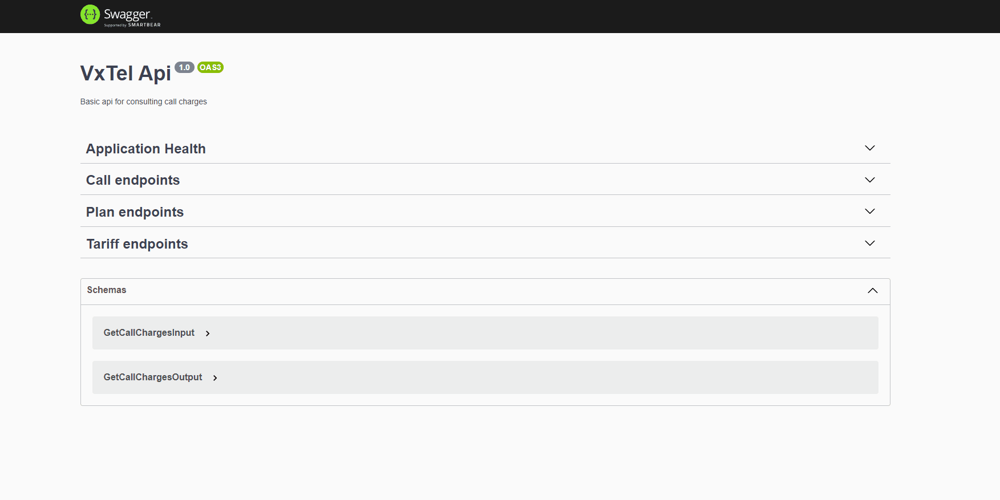

<h1 align="center">VxTel Rest API</h1>

<h2>Sobre</h2>

Este projeto foi desenvolvido para uma empresa fictícia chamada VxTel especializada em ligações de longa distância, com o intuito de fornecer uma API REST para a simulação de tarifas de ligações visando mostrar ao consumidor final a economia que ele pode obter ao adquirir um plano de telefonia

<h2> Funcionalidades </h2>

:heavy_check_mark: Consulta de planos <br/>
:heavy_check_mark: Consulta de tarifas <br/>
:heavy_check_mark: Simulação de preços por chamada <br/>
:heavy_check_mark: Documentação da API



<h2 > Requisitos </h2>

NodeJs: v16.19.0^ <br/>
Docker: v20.10.22^ <br/>
Docker compose: v2.14.1^ <br/>
yarn: v1.22.19^ <br/>
postgres: v15.0.0^ <br/>

<h2 > Como iniciar o projeto </h2>
Após baixar este projeto, entre na pasta raiz dele.

Instale os pacotes utilizando o comando na raiz do projeto
```
yarn install
```

Logo em seguida rode o comando abaixo para criar um container com uma instância de um banco de dados PostgreSQL
```
docker compose up -d
```

Aguarde a criação do container, e logo após execute o comando

```
yarn database:jobs
```
Para criar as tabelas e o popular o banco de dados

Para iniciar o serviço utilize o comando 

```bash
yarn start
```

ou utilize esse comando para iniciar em modo de desenvolvimento 
```
yarn start:dev
```

<h2> Tecnologias utilizadas </h2>
 * Typescript
 * PostgreSQL
 * TypeOrm
 * NestJS
 * Jest

<h2>Testes</h2>
Esse projeto tem testes para a camada de domínio.
Você pode utilizar os testes através dos seguintes comandos
Para executar todos os testes utilize:

```
yarn test
```

Para executar os testes das entidades/models utilize:

```
yarn test model
```

Para executar os testes dos objetos de valor utilize:

```
yarn test vo
```

<h5 align="center"> feito com :heart: by Moa Amaro</h5>
